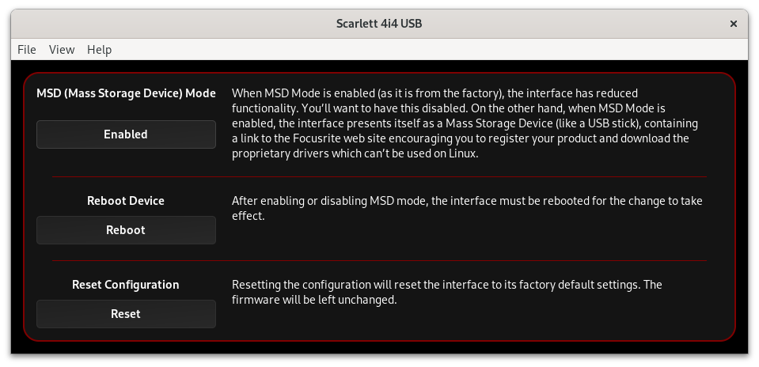
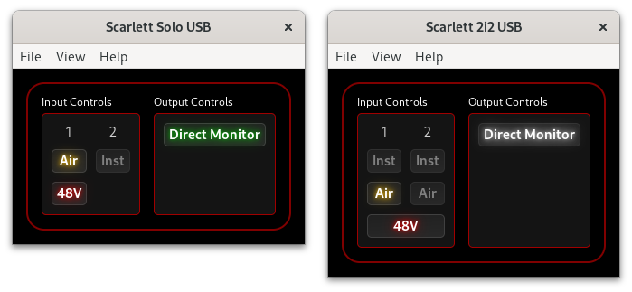
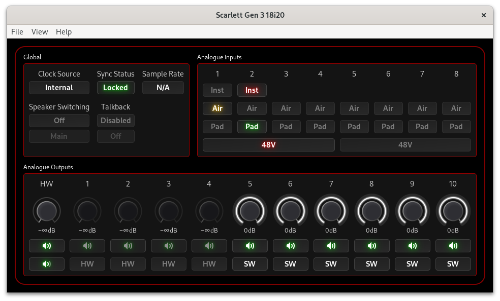
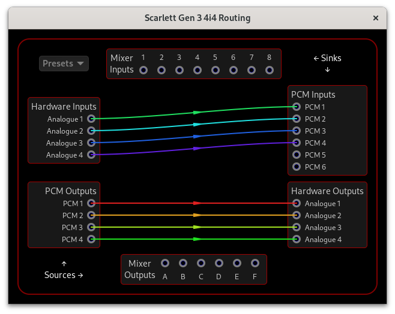
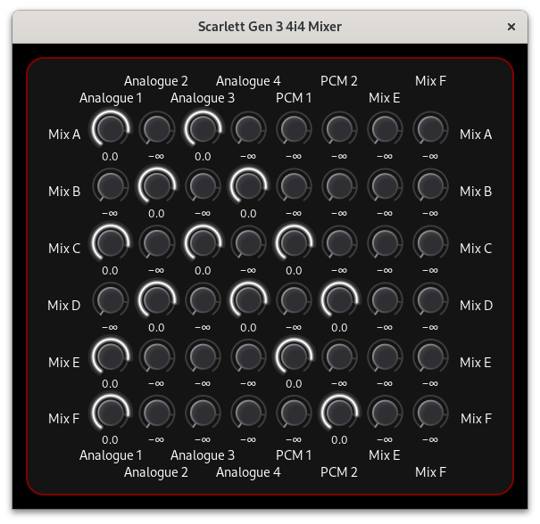
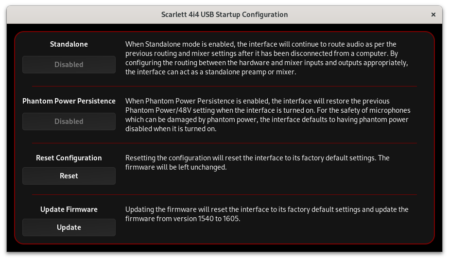

# ALSA Scarlett Gen 2/3 Control Panel Usage

Refer to [INSTALL.md](INSTALL.md) for prerequisites, how to build,
install, and run.

For usage instructions, read on...

## No interface connected

If no interface is detected (usually because there isn’t one
connected!) you’ll see this window:

Plug in an interface or select the menu option File → Interface
Simulation and load a demo file to make more interesting things
happen.

## MSD (Mass Storage Device) Mode

If MSD Mode is enabled (as it is from the factory), you need to
disable it and restart your interface to get access to its full
functionality.

## Using on Small Interfaces

For the small Gen 3 interfaces (Solo and 2i2), there’s just a few
buttons to control the Air, Line, Phantom Power, and Direct Monitor
settings. Mostly nothing that you can’t access from the front panel
anyway.

The Line/Inst (Level), Air, and 48V controls are described below in
the Analogue Input Controls section.

Direct Monitor sends the analogue input signals to the analogue
outputs for zero-latency monitoring. On the 2i2, you have the choice
of Mono or Stereo monitoring. Mono sends both inputs to the left and
right outputs. Stereo sends input 1 to the left, and input 2 to the
right output.

The one control not accessible from the front panel is “Phantom Power
Persistence” (menu option View → Startup) which controls the Phantom
Power state when the interface is powered on.

## Gen 2 6i6+, Gen 3 4i4+, Clarett USB, and Clarett+ Interfaces

The Gen 2 6i6+, Gen 3 4i4+, and Clarett interfaces have many controls
available. The controls are split between 4 windows, 3 of which are by
default hidden.

The main window has:
- Global Controls
- Analogue Input Controls
- Analogue Output Controls

The View menu option on the main window lets you open three other
windows which contain the other controls:
- Routing
- Mixer
- Startup

### Global Controls

Global controls affect the operation of the interface as a whole.

#### Clock Source

Clock Source selects where the interface receives its digital clock
from. If you aren’t using S/PDIF or ADAT inputs, set this to Internal.

#### Sync Status

Sync Status indicates if the interface is locked to a valid digital
clock. If you aren’t using S/PDIF or ADAT inputs and the Sync Status
is Unlocked, change the Clock Source to Internal.

#### Speaker Switching (18i8 Gen 3 and 18i20 Gen 3 only)

Speaker Switching lets you swap between two pairs of monitoring
speakers very easily.

When enabled (Main or Alt):

- Line Out 1–4 Volume Control Switches are locked to HW
- Line Out 3/4 routing is saved
- Line Out 3/4 routing is set to the Line Out 1/2 routing

When set to Main, Line outputs 3 and 4 are muted.

When set to Alt, Line outputs 1 and 2 are muted.

When disabled (Off):
- Global mute is activated
- Line Out 1–4 Volume Control Switches are unlocked
- Line Out 3/4 routing is restored to the saved values

#### Talkback (18i20 Gen 3 only)

Talkback lets you add another channel (usually the talkback mic) to a
mix with a button push, usually to talk to musicians, and without
using an additional mic channel.

The Talkback feature has a few parts:

- Talkback Microphone connected to Analogue Input 9
- Talkback Disable/Enable internal switch
- Talkback Off/On physical switch
- Talkback Mix (one switch per mix)
- Mix Input 25

To set up the talkback feature, set Mix Input 25 to the talkback
source (usually Analogue Input 9), enable the Talkback Mix switches
for the mixes you want the talkback input to be heard on, and change
the Talkback control from Disabled to Off. Leave the Mix Input 25 gain
controls at zero (−127dB), otherwise the talkback inputs will be heard
even when talkback is disabled/off.

Pressing the Talkback switch on the device will then lower the volume
of the other inputs on the mixes for which talkback is enabled and
unmute Mix Input 25 on those mixes.

Talkback can also be activated by changing the Talkback control from
Off to On.

The talkback microphone can also be used just the same as any of the
other analogue inputs and routed to a physical output, PCM input, or
mixer input.

### Analogue Input Controls

This is applicable to all interfaces except the Gen 2 18i20 which has
hardware-only buttons for these features.

#### Level

The Level buttons are used to select between Mic/Line and Instrument
level/impedance. When plugging in microphones or line-level equipment
to the input, set it to “Line”. The “Inst” setting is for instrument
with pickups such as guitars.

#### Air (Gen 3, Clarett USB, and Clarett+ only)

Enabling Air will transform your recordings and inspire you while
making music.

#### Pad

Enabling Pad engages an attenuator in the channel, giving you more
headroom for very hot signals.

#### Phantom Power (48V)

Gen 2 devices have a hardware button for controlling phantom power.

Gen 3 devices have hardware and software control of phantom power.
Turning the “48V” switch on sends “Phantom Power” to the XLR
microphone input. This is required for some microphones (such as
condensor microphones), and damaging to some microphones (particularly
vintage ribbon microphones).

On Gen 3 device, phantom power is turned off by default when the
interface is turned on. This can be changed in the startup
configuration (menu option View → Startup).

### Analogue Output Controls

The analogue output controls let you set the output volume (gain) on
the analogue line out and headphone outputs. All interfaces support
setting the gain and muting individual channels.

Click and drag up/down to change the volume, or use your mouse scroll
wheel. You can also double-click on the volume dial to quickly toggle
the volume between the minimum value and 0dB.

The bigger interfaces: Gen 2 18i20, Gen 3 18i8, and Gen 3 18i20 have a
switchable hardware/software volume control. The position of the big
volume knob on the front of the interface is indicated by the “HW”
dial in the GUI. The analogue outputs can have their volume set either
by the knob (“HW” setting of of the HW/SW button) or by the dials on
each output (“SW” setting of the HW/SW button).

When set to HW, the mute/volume status for those channels is
controlled by the hardware volume knob and the global dim/mute
controls and the software volume dial and mute button for those
channels are disabled.

There are “mute” and “dim” (reduce volume) buttons below the “HW” dial
which affect only the outputs with “HW” control enabled. The Gen 3
18i8 doesn’t have physical buttons or indicator lights for these
controls, but the 18i20 devices do.

On the other (smaller) interfaces, the big volume knob on the front of
the interface controls the volume of the Line 1 and 2 outputs. This is
in addition to the software volume control, therefore both must be
turned up in order to hear anything. The other (line 3+) analogue
outputs are only controlled by the software controls.

The volume controls for the headphone outputs on each interface
operate in addition to any other hardware or software volume controls
for those channels. When using headphones, the volumes for those
channels would usually be set to 0dB and the actual volume controlled
with the physical headphone volume control(s).

### Routing

The routing window allows complete control of signal routing between
the hardware inputs/outputs, internal mixer, and PCM (USB)
inputs/outputs.

To manage the routing connections:

- Click and drag from a source to a sink or a sink to a source to
  connect them. Audio from the source will then be sent to that sink.

- Click on a source or a sink to clear the links connected to that
  source/sink.

Note that a sink can only be connected to one source, but one source
can be connected to many sinks. If you want a sink to receive input
from more than one source, use the mixer inputs and outputs.

The Presets menu can be used to clear all connections, or to set up
common configurations:

- The “Direct” preset sets up the usual configuration using the
  interface as an audio interface by connecting:

  - all Hardware Inputs to PCM Inputs
  - all PCM Outputs to Hardware Outputs

- The “Preamp” preset connects all Hardware Inputs to Hardware Outputs.

- The “Stereo Out” preset connects PCM 1 and 2 Outputs to pairs of
  Hardware Outputs.

The Direct routing configuration is the simplest most-generally-useful
configuration:

#### Loopback

Gen 2, Clarett USB, and Clarett+ interfaces have as many PCM Inputs as
Hardware Inputs. Gen 3 interfaces have two more PCM Inputs which
Focusrite Control uses as “Loopback” inputs.

The “Loopback” feature advertised for Gen 3 devices is actually a
limitation of the proprietary Focusrite Control software. All devices
(except Solo/2i2) support full reassignment of the PCM Inputs, so you
can have any PCM Input as a “Loopback” or assigned to any other
source.

#### Talkback

The Gen 3 18i20 talkback microphone is Analogue Input 9 and can be
routed like any other source. If you want to record using it, there is
no need for the loopback hack suggested by the vendor. Just route it
to a PCM Input.

### Mixer

If you use the Routing window to connect Sources to Mixer Inputs and
Mixer Outputs to Sinks, then you can use the Mixer window to set the
amount of each Mixer Input that is sent to each Mixer Output using a
matrix of controls:

Click and drag up/down on the gain controls to adjust, or use your
mouse scroll wheel. You can also double-click on the dial to quickly
toggle between the minimum value and 0dB.

### Startup

The Startup window is used to configure settings that only take effect
when the interface is powered on.

#### Standalone

When Standalone mode is enabled, the interface will continue to route
audio as per the previous routing and mixer settings after it has been
disconnected from a computer. By configuring the routing between the
hardware and mixer inputs and outputs appropriately, the interface can
act as a standalone preamp or mixer.

Standalone mode is supported on all devices supported by the kernel
driver. Even the 4i4 Gen 3 (which is bus-powered) will operate in
standalone mode.

#### Phantom Power Persistence (Gen 3 only)

When Phantom Power Persistence is enabled, the interface will restore
the previous Phantom Power/48V setting when the interface is turned
on. For the safety of microphones which can be damaged by phantom
power, the interface defaults to having phantom power disabled when it
is turned on.

#### MSD (Mass Storage Device) Mode (Gen 3 only)

When MSD Mode is enabled (as it is from the factory), the interface
has reduced functionality. You’ll want to have this disabled. On the
other hand, when MSD Mode is enabled, the interface presents itself as
a Mass Storage Device (like a USB stick), containing a link to the
Focusrite web site encouraging you to register your product and
download the proprietary drivers which can’t be used on Linux.

By default, once MSD Mode is disabled, the control for it is hidden.
If for some reason you want to re-enable MSD Mode, you can set the
`device_setup` option to 3 to get the control back.

## Load/Save Configuration

The entire state of the interface can be loaded and saved using the
File → Load Configuration and File → Save Configuration menu options.

Internally, this uses `alsactl`:

- Load: `alsactl restore USB -f <fn>`
- Save: `alsactl store USB -f <fn>`

The saved state files can be used to simulate an interface if you
don’t have one attached. The `demo` directory in the distribution
contains a sample file for every supported model.

## Interface Simulation Mode

The GUI can load an `alsactl` state file saved from a real interface
and display a GUI as if the corresponding interface was connected.

This is useful if you don’t have an interface connected and want to
try, develop, or debug the GUI.

Either specify the `.state` filename on the command line or select the
menu option File → Interface Simulation to load.

## Known Bugs/Issues

- The linear-dB scale of the volume controls doesn’t work well. Lower
  volumes (e.g. below −30dB) don’t need as much fine control as higher
  volumes.

- Can’t select (focus) the gain/volume controls or use a keyboard to
  adjust them.

- Level meters don’t work if you're not running the driver from Linux
  6.7.

- Load/Save uses `alsactl` which will be confused if the ALSA
  interface name (e.g. `USB`) changes.

- Load/Save is not implemented for simulated interfaces.

- Lots of “couldn't find weak ref” warnings are emitted when loading a
  state file for simulation.

- The read-only status of controls in interface simulation mode does
  not change when the HW/SW button is clicked.

- When there’s more than one main window open, closing one of them
  doesn’t free and close everything related to that card.

- There is no facility to group channels into stereo pairs (needs
  kernel support to save this information in the interface).

- There is no facility to give channels custom names (needs kernel
  support to save this information in the interface).

- No keyboard accelerators (e.g. Ctrl-Q to quit) have been
  implemented.
