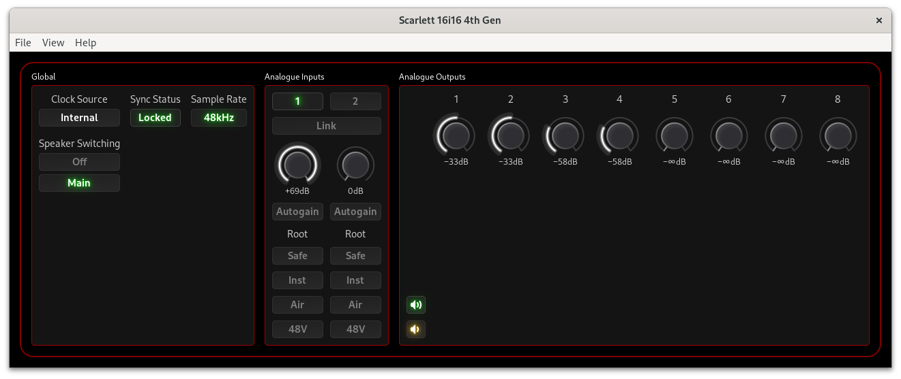
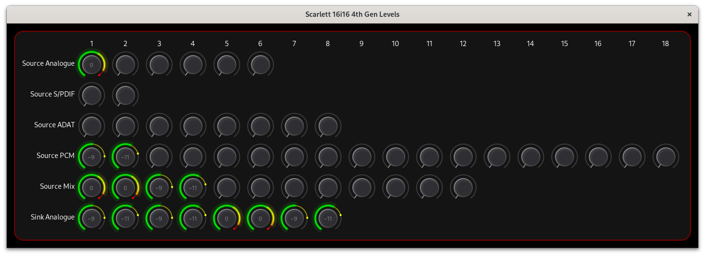

# ALSA Scarlett Control Panel

## Scarlett Big 4th Gen Interfaces

This document describes how to use the ALSA Scarlett Control Panel
with the big Scarlett 4th Gen interfaces:

- Scarlett 4th Gen 16i16, 18i16, 18i20

### FCP Driver

The big 4th Gen interfaces are supported by a new “FCP” (Focusrite
Control Protocol) driver introduced in Linux 6.14. If you haven't
installed
[fcp-support](https://github.com/geoffreybennett/fcp-support) yet, you
need to do that (and update the firmware) before you can use
alsa-scarlett-gui.

## Main Window

The main window is divided into three sections:
- Global Controls
- Analogue Input Controls
- Analogue Output Controls

The main window for the 16i16 interface is shown below. The 18i16 and
18i20 interfaces are similar, but with more controls.

### Global Controls

#### Clock Source (interfaces with S/PDIF or ADAT inputs only)

Clock Source selects where the interface receives its digital clock
from. If you aren’t using S/PDIF or ADAT inputs, set this to Internal.

#### Sync Status

Sync Status indicates if the interface is locked to a valid digital
clock. If you aren’t using S/PDIF or ADAT inputs and the Sync Status
is Unlocked, change the Clock Source to Internal.

#### Sample Rate

Sample Rate is informative only, and displays the current sample rate
if the interface is currently in use. In ALSA, the sample rate is set
by the application using the interface, which is usually a sound
server such as PulseAudio, JACK, or PipeWire.

#### Speaker Switching

Speaker Switching lets you swap between two pairs of monitoring
speakers very easily.

### Analogue Input Controls

#### Input Select

The “Input Select” control allows you to choose which channel the
hardware 48V, Inst, Air, Auto, and Safe buttons control.

#### Link

The “Link” control links the 48V, Inst, Air, Auto, and Safe controls
together so that they control a stereo pair of channels
simultaneously.

#### Gain

The “Gain” controls adjust the input gain for the selected channel.
Click and drag up/down on the control to adjust the gain, use your
mouse scroll wheel, or click the control to select it and use the
arrow keys, Page Up, Page Down, Home, and End keys.

#### Autogain

When the “Autogain” control is enabled, the interface will listen to
the input signal for ten seconds and automatically adjust the gain to
get the best signal level. When autogain is not running, the
most-recent autogain exit status is shown below the “Autogain”
control.

#### Safe

“Safe” mode is a feature that automatically reduces the gain if the
signal is too loud. This can be useful to prevent clipping.

#### Instrument

The Inst button(s) are used to select between Mic/Line and Instrument
level/impedance. When plugging in microphones or line-level equipment
(such as a synthesizer, external preamp, or effects processor) to the
input, set it to “Line”. The “Inst” setting is for instruments with
pickups such as guitars.

#### Air

The Scarlett 3rd Gen introduced Air mode which transformed your
recordings and inspired you while making music by boosting the
signal’s high-end. The 4th Gen interfaces now call that “Air Presence”
and add a new mode “Air Presence+Drive” which boosts mid-range
harmonics in your sound.

#### Phantom Power (48V)

Turning the “48V” switch on sends “Phantom Power” to the XLR
microphone input. This is required for some microphones (such as
condensor microphones), and damaging to some microphones (particularly
vintage ribbon microphones).

### Analogue Output Controls

The analogue output controls are a bit sparse. More controls are
coming soon.

#### Volume Knobs

The volume knobs control the volume of the analogue outputs. The two
channels of the stereo pairs are shown separately, but are internally
linked together.

#### Mute and Dim

The speaker icon buttons are “mute” and “dim” (reduce volume) buttons,
corresponding to the front-panel buttons on the interface (although
only the 18i20 has a physical dim button).

## Routing and Mixing

The routing window allows (almost) complete control of signal routing
between the hardware inputs/outputs, internal mixer, and PCM (USB)
inputs/outputs.

The routing and mixing capabilities of the big 4th Gen interfaces are
the same in concept as the older interfaces, but the mixer inputs are
fixed and not shown in the routing window as there are too many to
sensibly display.

From the main window, open the Routing window with the View → Routing
menu option or pressing Ctrl-R:

To manage the routing connections:

- Click and drag from a source to a sink or a sink to a source to
  connect them. Audio from the source will then be sent to that sink.

- Click on a source or a sink to clear the links connected to that
  source/sink.

Note that a sink can only be connected to one source, but one source
can be connected to many sinks. If you want a sink to receive input
from more than one source, connect the sinks to mixer outputs:

- Connect mixer outputs to the sinks that you want to receive the
  mixed audio
- Use the Mixer window to set the amount of each mixer input that is
  sent to each mixer output

The Presets menu can be used to clear all connections, or to set up
common configurations:

- The “Direct” preset sets up the usual configuration using the
  interface as a regular audio interface by connecting:

  - all Hardware Inputs to PCM Inputs
  - all PCM Outputs to Hardware Outputs

- The “Preamp” preset connects all Hardware Inputs to Hardware
  Outputs.

- The “Stereo Out” preset connects PCM 1 and 2 Outputs to pairs of
  Hardware Outputs.

To adjust the routing:

- Click and drag from a source to a sink or a sink to a source to
  connect them. Audio from the source will then be sent to that sink.

- Click on a source or a sink to clear the links connected to that
  source/sink.

Note that a sink can only be connected to one source, but one source
can be connected to many sinks.

To adjust the mixer output levels:

1) Open the mixer window with the main window View → Mixer menu
   option, or press Ctrl-M.

2) Mixer levels can be adjusted with your keyboard or mouse in the
   same way as the [Gain Controls](#gain).

## Levels

The meters show the levels seen by the interface at every routing
source as well as the analogue outputs. Open this window by selecting
the View → Levels menu option or pressing Ctrl-L.

Look at this in conjunction with the routing window to understand
which meter corresponds to which source or sink.

Thanks for reading this far! If you appreciate the hundreds of hours
of work that went into the kernel driver, the control panel, and this
documentation, please consider supporting the author with a
[donation](../README.md#donations).
